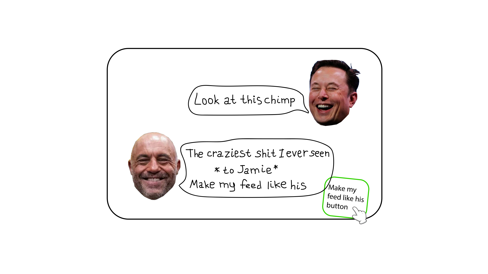

# Caught & Shared

A research project exploring conscious control in recommender systems.

**Website**: https://rjeyskey.github.io/Caught-and-Shared/

**Paper**: [caught-and-shared-conscious-control-in-recommender-systems.pdf](caught-and-shared-conscious-control-in-recommender-systems.pdf)

## The Idea

Modern recommender systems learn from what users do.

Caught & Shared explores a complementary idea:

**What if users could explicitly choose whose taste influences their recommendations?**

Instead of relying solely on implicit signals, users may consciously select mentors — friends, creators, or people they admire — and borrow their perspective.

Choose who influences your recommendations.
Share taste.
Build recommendation systems together.

# Core Implementation Taxonomy

Regardless of the underlying architecture, the Caught & Shared concept can be realized through three universal strategies for injecting mentor influence:

## 1. Graph-based (Structural) Approaches

We explicitly add mentor relationships into the graph. This can be done by transforming the original user-item bipartite graph into a heterogeneous multi-relational graph or by using alternative techniques that preserve bipartiteness.

**Main variants**  
- **Heterogeneous Graph** — Direct user → mentor edges (most powerful signal)  
- **Virtual Proxy Items** — Represent each mentor as a special virtual item  
- **Dual Graph** — Separate bipartite and social graphs with later fusion  
- **MetaPath-based** — Information flows through predefined paths (e.g., `User → Mentor → Item`)

**Strengths:** Strong, direct influence and natural propagation.  
**Weaknesses:** Varies by variant — from breaking bipartiteness to increased complexity.

## 2. Contrastive Alignment

Instead of changing the graph, we add a contrastive objective during training that pulls the user’s embedding closer to their chosen mentor’s embedding in latent space, while pushing it away from random users.

**Key idea**  
- Positive pair: *(user, mentor)*  
- Negative pairs: *(user, random users)*

**Strengths**  
- Preserves original graph structure  
- Works with any neural model (Two‑Tower, GNNs, Transformers)  
- Creates meaningful semantic closeness between user and mentor

**Weaknesses:** Influence is softer and requires mentor choice data during training.

## 3. Embedding Blending (Composite)

The simplest and most controllable method — directly blend user and mentor embeddings at inference time:

User_final = (1 - α) * User_emb + α * Mentor_emb

**Strengths**  
- Maximum user control and transparency  
- Extremely easy to implement and explain  
- Works on top of any existing model  
- Perfect for MVP and production

**Weaknesses:** Post-processing approach (model doesn’t learn mentor relationships during training).

---

## Influence Control (Product Feature)

When choosing a mentor, users can select the depth of influence:

- **Light (20%)** — Gentle nudge toward the mentor’s taste  
- **Balanced (45%)** — Nearly equal mix of both tastes  
- **Deep (70%)** — Strong immersion into the mentor’s style  

This gives users a clear sense of agency and reduces the fear of completely losing their own identity in recommendations.

Additionally, users can:  
- Temporarily try different influence levels  
- Revert to previous recommendation state (“Reset to my original taste”)  
- Fine‑tune alpha manually if desired

---

## Future Growth: Conscious Recommendations & Multi‑Category Mentors

**Caught & Shared** is the first building block of a broader vision — **Conscious Recommendations**.

In the future, users will be able to assign different mentors to different life categories (sneakers, outerwear, tech, home, workwear, etc.). This creates a personal **“Mentor Team”** where each sphere of life is guided by someone whose taste the user genuinely admires.

This approach transforms recommendations from passive algorithmic output into a deeply personal, human‑curated experience.